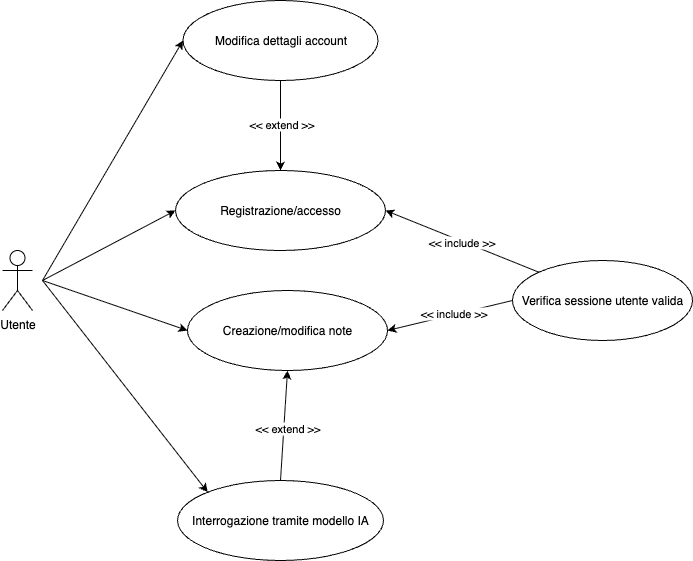

# Software Requirements Specification
## For Write It Down Web App

Version 1.0 
Prepared by <author>Lorenzo Sartori</author> @ <organization>UniPR</organization>
<date created>  

Table of Contents
=================
* 1 [Introduction](#1-introduction)
  * 1.1 [Document Purpose](#11-document-purpose)
  * 1.2 [Product Scope](#12-product-scope)
  * 1.3 [Definitions, Acronyms and Abbreviations](#13-definitions-acronyms-and-abbreviations)
  * 1.4 [References](#14-references)
  * 1.5 [Document Overview](#15-document-overview)
* 2 [Product Overview](#2-product-overview)
  * 2.1 [Product Perspective](#21-product-perspective)
  * 2.2 [Product Functions](#22-product-functions)
  * 2.3 [Product Constraints](#23-product-constraints)
  * 2.4 [User Characteristics](#24-user-characteristics)
  * 2.5 [Assumptions and Dependencies](#25-assumptions-and-dependencies)
  * 2.6 [Apportioning of Requirements](#26-apportioning-of-requirements)
* 3 [Requirements](#3-requirements)
  * 3.1 [External Interfaces](#31-external-interfaces)
    * 3.1.1 [User Interfaces](#311-user-interfaces)
    * 3.1.2 [Hardware Interfaces](#312-hardware-interfaces)
    * 3.1.3 [Software Interfaces](#313-software-interfaces)
  * 3.2 [Functional](#32-functional)
  * 3.3 [Quality of Service](#33-quality-of-service)
    * 3.3.1 [Performance](#331-performance)
    * 3.3.2 [Security](#332-security)
    * 3.3.3 [Reliability](#333-reliability)
    * 3.3.4 [Availability](#334-availability)
  * 3.4 [Compliance](#34-compliance)
  * 3.5 [Design and Implementation](#35-design-and-implementation)
    * 3.5.1 [Installation](#351-installation)
    * 3.5.2 [Distribution](#352-distribution)
    * 3.5.3 [Cost](#353-cost)
    * 3.5.4 [Deadline](#354-deadline)
* 4 [Verification](#4-verification)
* 5 [Appendixes](#5-appendixes)

## 1. Introduction
Il seguente documento ha lo scopo di descrivere gli aspetti principali della web app Write It Down, un progetto sviluppato per il corso di tecnologie internet @ UniPR.

### 1.1 Document Purpose
Il documento raccoglie i requisiti software della app. Il documento è rivolto a ingegneri del software, ingegneri di basi di dati, sviluppatori web ed entusiasti delle potenziali applicazioni di framework NextJS e di api per l'utilizzo di Intelligenza Artificiale nella vita di tutti i giorni.

### 1.2 Product Scope
L'obiettivo dell'applicativo è quello di fornire uno strumento semplice e facile da usare per raccogliere note e appunti riguardo una o più materie di studio da parte dell'utente. Inoltre l'applicativo offre un'integrazione con strumenti di Intelligenza Artificiale per funzionare come aiutante durante lo studio basato sugli appunti. 
Ogni utente è in grado di creare un account personale dove verranno salvate le note create.

### 1.3 Definitions, Acronyms and Abbreviations

### 1.4 References
List any other documents or Web addresses to which this SRS refers. These may include user interface style guides, contracts, standards, system requirements specifications, use case documents, or a vision and scope document. Provide enough information so that the reader could access a copy of each reference, including title, author, version number, date, and source or location.
Nel corpo del documento sarà fatto riferimento ad alcuni strumenti/librerie software:
* Shadcn/ui: https://ui.shadcn.com/docs
* Better Auth (Autenticazione utente): https://www.better-auth.com/docs/introduction
* TipTap Editor: https://tiptap.dev/docs/editor/getting-started/overview

## 2. Product Overview

### 2.1 Product Perspective
Describe the context and origin of the product being specified in this SRS. For example, state whether this product is a follow-on member of a product family, a replacement for certain existing systems, or a new, self-contained product. If the SRS defines a component of a larger system, relate the requirements of the larger system to the functionality of this software and identify interfaces between the two. A simple diagram that shows the major components of the overall system, subsystem interconnections, and external interfaces can be helpful.

### 2.2 Product Functions
* Registrazione di un account personale
* Autenticazione del proprio account tramite email/username e password
* Modifica email/username e password
* Creazione nota
* Modifica nota
* Cancellazione nota
* Interrogazione sulle proprie conoscenze del contenuto della nota da parte di un LLM ( Google Gemini )

### 2.3 Product Constraints
* Uso di framework ReactJS, in questo caso NextJS
* Uso di un database SQL o NoSQL
* Definizione di route API custom

### 2.4 User Characteristics
Al momento non esiste una distizione tra utente finale e utente admin. Per questioni di test l'API del modello AI non è soggetta a limitazioni.

### 2.5 Assumptions and Dependencies
List any assumed factors (as opposed to known facts) that could affect the requirements stated in the SRS. These could include third-party or commercial components that you plan to use, issues around the development or operating environment, or constraints. The project could be affected if these assumptions are incorrect, are not shared, or change. Also identify any dependencies the project has on external factors, such as software components that you intend to reuse from another project, unless they are already documented elsewhere (for example, in the vision and scope document or the project plan).

### 2.6 Apportioning of Requirements
Apportion the software requirements to software elements. For requirements that will require implementation over multiple software elements, or when allocation to a software element is initially undefined, this should be so stated. A cross reference table by function and software element should be used to summarize the apportioning.

Identify requirements that may be delayed until future versions of the system (e.g., blocks and/or increments).

## 3. Requirements
> This section specifies the software product's requirements. Specify all of the software requirements to a level of detail sufficient to enable designers to design a software system to satisfy those requirements, and to enable testers to test that the software system satisfies those requirements.

> The specific requirements should:
* Be uniquely identifiable.
* State the subject of the requirement (e.g., system, software, etc.) and what shall be done.
* Optionally state the conditions and constraints, if any.
* Describe every input (stimulus) into the software system, every output (response) from the software system, and all functions performed by the software system in response to an input or in support of an output.
* Be verifiable (e.g., the requirement realization can be proven to the customer's satisfaction)
* Conform to agreed upon syntax, keywords, and terms.

### 3.1 External Interfaces
> This subsection defines all the inputs into and outputs requirements of the software system. Each interface defined may include the following content:
* Name of item
* Source of input or destination of output
* Valid range, accuracy, and/or tolerance
* Units of measure
* Timing
* Relationships to other inputs/outputs
* Screen formats/organization
* Window formats/organization
* Data formats
* Command formats
* End messages

#### 3.1.1 User interfaces
Le interfacce utente sono 4:
* Landing page: pagina di atterraggio in cui un nuovo utente arriva. La pagina descrive in poche parole la funzionalità del sistema e offre, attraverso un bottone, la possibilità di registrarsi per provare l'applicativo
* Pagina di registrazione/accesso utente: la pagina offre la possibilità ad un nuovo utente di registrarsi e a quelli che possiedono già un account di accedere alle proprie note o area utente.
* Pagina di creazione/modifica delle note: la pagina consente all'utente di visualizzare le proprie note e i rispettivi contenuti. La pagina offre anche la possibilità di navigare attraverso le diverse note attraverso una sidebar e di modificarne il contenuto selezionando una nota e scrivendo nell'apposito Rich Text Editor.
* Area Utente: l'area utente consente di visualizzare i dati relativi al proprio account e gestirne alcuni aspetti come modificare la propria email/username e la propria password.

#### 3.1.3 Software interfaces
Per funzionare il software sfrutta alcuni componenti essenziali:
* Server NodeJS per servire le pagine al cliente ed eseguire richieste lato server
* Framework ReactJS: NextJS per gestire richieste lato server in modo complementare al client
* DB relazionale MySQL, l'integrazione avviene tramite il pacchetto npm mysql2
* Servizio di LLM IA Google Gemini, l'integrazione avviene tramite il pacchetto npm @google/genai
* Tiptap Rich Text Editor, l'integrazione avviene tramite il pacchetto npm tiptap
* Icone utilizzate in tutto l'applicativo, l'integrazione avviene tramite il pacchetto npm lucide-react
* Libreria di componenti front-end estendibili shacdn/ui, l'integrazione avviene tramite il pacchetto npm shadcn@latest e includendo separatamente ogni componente utilizzato. La lista di componenti disponibili qui https://ui.shadcn.com/docs/components
* Better Auth, per autenticazione e verifica della sessione dell'utente, l'integrazione avviene tramite il pacchetto npm better-auth

### 3.2 Functional
> This section specifies the requirements of functional effects that the software-to-be is to have on its environment.

### 3.3 Quality of Service

#### 3.3.1 Performance
L'applicativo dovrebbe permettere di eseguire query sul DB in tempi ragionevoli in modo da permettere al server di restituire il contenuto delle note nel più breve tempo possibile.
L'applicativo dovrebbe permettere all'utente di creare e accedere alle note in tempi ragionevolmente brevi permettendo una navigazione agile e piacevole.
L'applicativo deve interfacciarsi con il modello di IA nel modo più veloce possibile e offrire all'utente un feedback non appena questo è disponibile.

#### 3.3.2 Security
* I dettagli dell'account utente non devono essere condivisi con nessun soggetto al di fuori dell'applicativo stesso. L'indirizzo email è utilizzato solo per la registrazione e l'accesso all'area utente.
* La password creata da un utente deve essere salvata in maniera sicura e non decifrabile sotto forma di hash all'interno del DB per evitare ad ogni costo fughe di dati.
* L'utente deve poter accedere solo alle proprie note. In nessun caso un utente deve essere in grado di visionare e/o modificare le note altrui.

### 3.5 Design and Implementation

#### 3.5.1 Installation
L'installazione del software avviene tramite il comando `npm install --force`.
Al momento il flag --force è necessario per alcuni problemi relativi ad una dipendenza ( @tiptap/core, vedi issue #15880 https://github.com/open-webui/open-webui/issues/15880 ).

Nel file .env è necessario impostare alcune variabili per il processo, in particolare:
* BETTER_AUTH_SECRET : usato da better-auth per la cifratura e la generazione di hash
* BETTER_AUTH_URL : url base della web app
* DB_HOST : indirizzo ip del server MySQL
* DB_USER : utente del server MySQL
* DB_PWD : password dell'utente MySQL
* DB_NAME : nome del database in cui si lavora
* BASE_URL : url base della web app
* GEMINI_KEY : chiave API per Google Gemini

Il server NextJS può essere eseguito con il comando `pnpm dev` oppure `next dev --turbopack`.
Il processo di build può essere eseguito con il comando `pnpm build` oppure `next build`.

#### 3.5.2 Distribution
Il software è stato costruito per funzionare al meglio su dispositivi desktop, tuttavia è disponibile anche una versione per l'utilizzo su dispositivi mobili.

#### 3.5.3 Cost
Costo di sviluppo del progetto: indefinito.

#### 3.5.4 Deadline
Deadline di sviluppo: Agosto 2025.